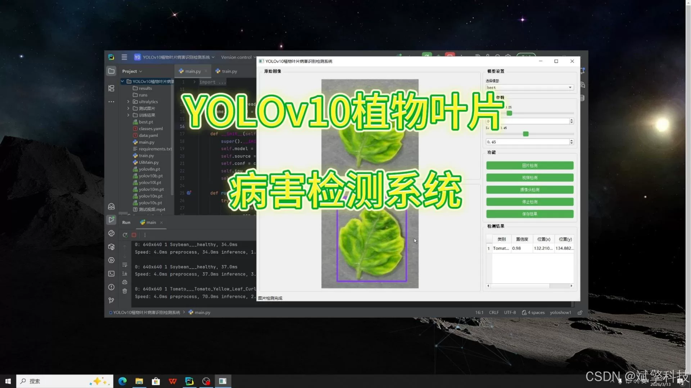
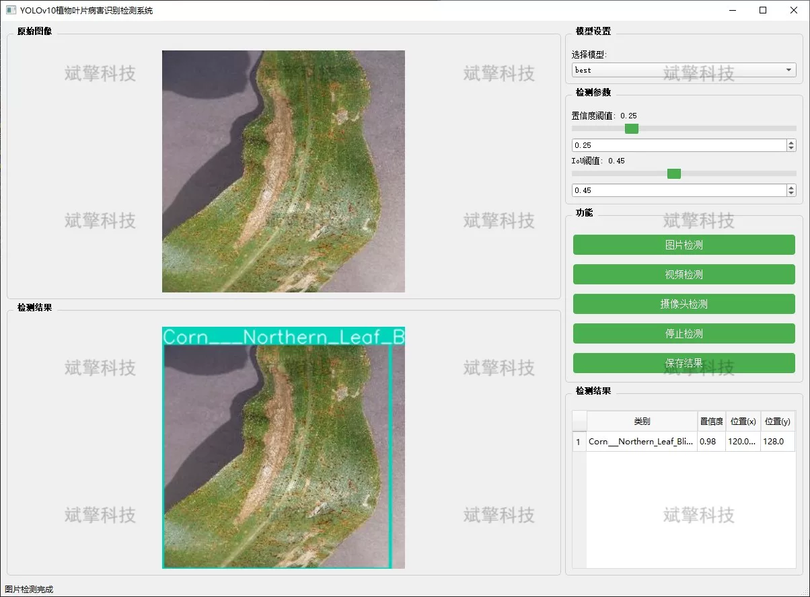
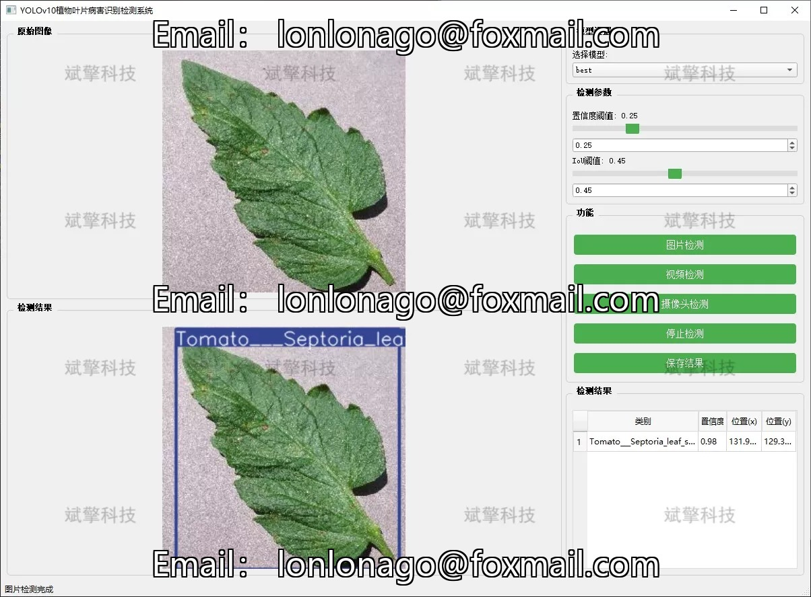
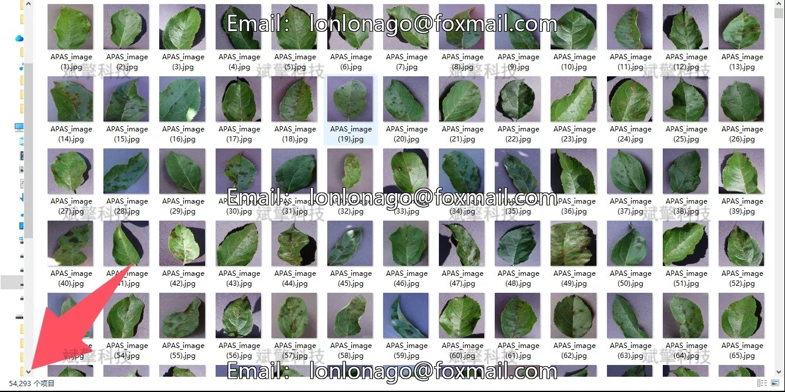
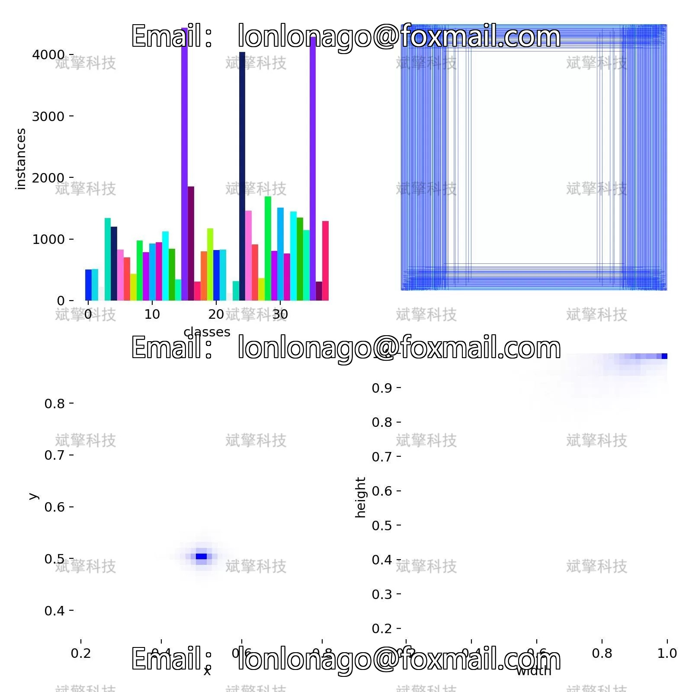
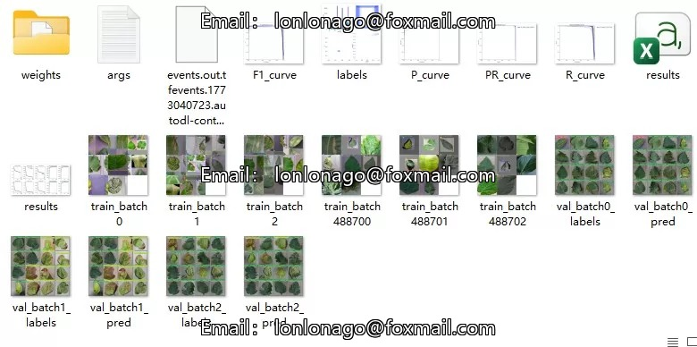
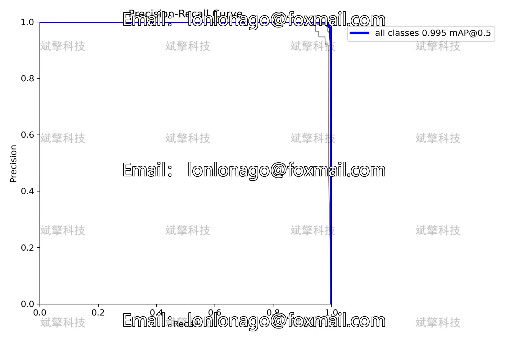
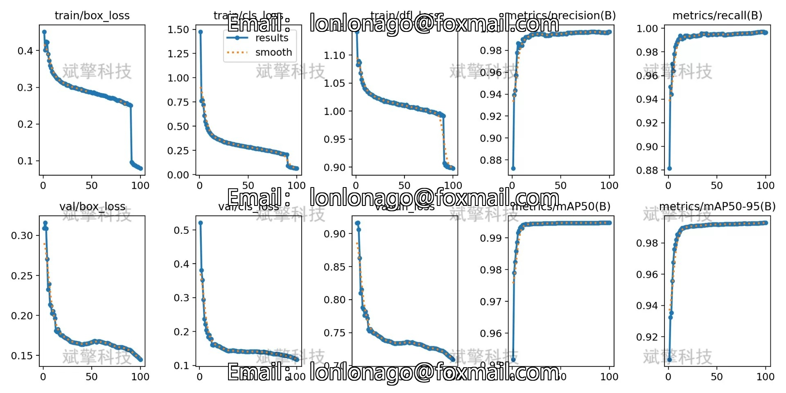
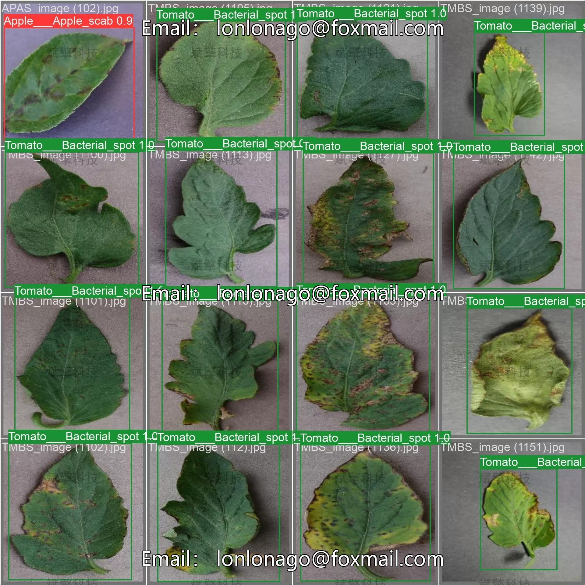

# Plant leaf disease detection system based on YOLOv10 deep learning

## Body

Based on the YOLOv10 deep learning model, a plant leaf disease detection system (YOLOv10+YOLO dataset + UI interface + Python project + model) is constructed.

Plant diseases are one of the main factors affecting crop yield and quality, and traditional manual detection methods are inefficient and subjective, which cannot meet the needs of precision management in modern agriculture. This study has built a plant leaf disease recognition detection system based on the YOLOv10 deep learning model. The system integrates a plant leaf dataset containing 54,293 images, covering 14 types of plants including apples, blueberries, cherries, corn, grapes, citrus, peaches, chili peppers, potatoes, raspberries, soybeans, pumpkins, strawberries, tomatoes, and a total of 38 categories (including diseases and healthy leaves).

Experimental results show that the system has high detection accuracy and real-time performance, and can effectively identify leaf diseases of different plants. The system provides three modes of image detection, video detection, and real-time camera detection, with an easy-to-use interactive interface, facilitating practical deployment. This research provides a feasible solution for intelligent monitoring of plant diseases, having important theoretical and application value.

System Features

✅ Image Detection: Can detect images and return detection boxes and category information.

✅ Video Detection: Supports input of video files, detecting each frame in the video.

✅ Real-Time Camera Detection: Connects USB cameras to achieve real-time monitoring.

✅ Parameter Real-Time Adjustment (Confidence and IoU thresholds)

Dataset Introduction

Total number of images: 54,293

## Images

## Payment

Here is a pay link on Stripe ( https://buy.stripe.com/3cs8yP7sY87d0vu9AB ). Please contact me lonlonago@foxmail.com after funding $89, and I will send you a complete data files , thank you!

